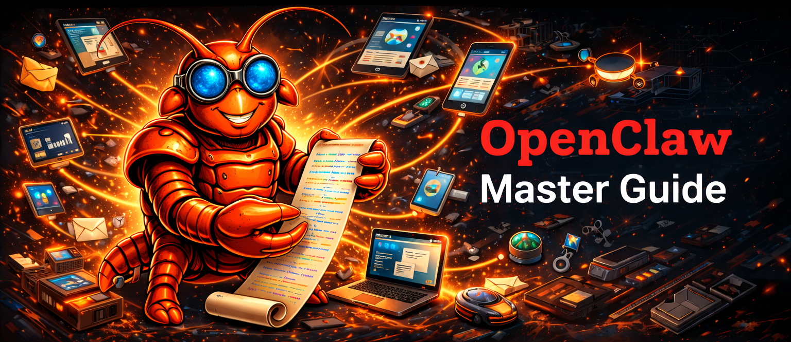

# OpenClaw: The Ultimate Guide to the Open-Source AI Agent Framework

Welcome to the comprehensive guide for **OpenClaw** (formerly known as Clawdbot and Moltbot). This repository serves as a detailed resource for understanding, installing, and leveraging OpenClaw to build powerful autonomous AI workflows.

## What is OpenClaw?

**OpenClaw** is a state-of-the-art, open-source autonomous AI agent framework designed to function as a personal assistant that lives within your existing communication channels. Unlike centralized AI services, OpenClaw is built with a **local-first philosophy**, meaning it runs on your own hardware, giving you full control over your data and integrations.

The framework is highly extensible, supporting a vast ecosystem of "skills" that allow the agent to perform specialized tasks—from managing your calendar to controlling your smart home or even writing and deploying code.

| Feature | Description |
| :--- | :--- |
| **Multi-Channel** | Integration with WhatsApp, Telegram, Slack, Discord, Signal, iMessage, and more. |
| **Local-First** | Runs on macOS, Linux, and Windows (via WSL2), ensuring privacy and low latency. |
| **Extensible** | Access to over 5,000 community-built skills via the ClawHub registry. |
| **Autonomous** | Capable of running long-duration tasks without constant human intervention. |
| **Voice & Vision** | Built-in support for voice interactions and a live visual canvas (A2UI). |

---

## Deployment & Installation

OpenClaw can be installed locally for personal use or deployed on a VPS for 24/7 availability.

### 1. Local Installation
Ensure you have **Node.js version 22 or higher** installed.
```bash
npm install -g openclaw@latest
openclaw onboard --install-daemon
```

### 2. AWS VPS (EC2) Deployment
Running OpenClaw on an AWS VPS allows your agent to be "always-on" without relying on your local machine.
- **Recommended Instance**: `t3.medium` or `m7i-flex.large` (at least 8GB RAM recommended for heavy browser automation).
- **Operating System**: Ubuntu 22.04 LTS.
- **Setup Guide**: [Install OpenClaw on AWS for Free](https://www.youtube.com/watch?v=9iotTtgS0Ws)

### 3. Docker Deployment
For users who prefer containerization, OpenClaw provides a robust Docker setup.
```bash
git clone https://github.com/openclaw/openclaw.git
cd openclaw
docker-compose up -d
```
- **Resource**: [Detailed Docker Setup Guide](https://til.simonwillison.net/llms/openclaw-docker)

### 4. Other Hosting Options
| Provider | Method | Link |
| :--- | :--- | :--- |
| **DigitalOcean** | 1-Click App | [DO Guide](https://www.digitalocean.com/community/tutorials/how-to-run-openclaw) |
| **Hostinger** | VPS + Docker | [Hostinger Tutorial](https://www.youtube.com/watch?v=XvEDmYObHaI) |
| **Cloudflare** | Moltworker | [Cloudflare Repo](https://github.com/cloudflare/moltworker) |

---

## Real-World Use Cases

OpenClaw's flexibility allows it to be used in a variety of professional and personal scenarios. Below are some of the most impactful ways people are currently using the framework.

### 1. Developer Productivity & DevOps
- **CI/CD Triggers**: Start a build or deploy a staging environment directly from a Telegram message.
- **Code Auditing**: Automatically scan new pull requests for security vulnerabilities.
- **Infrastructure Management**: Monitor server health and restart services via WhatsApp.

### 2. Marketing & Content Automation
- **Lead Generation**: Monitor X (Twitter) for specific keywords and engage with potential leads automatically.
- **Content Distribution**: Take a single piece of content and format/distribute it across Slack, Discord, and LinkedIn.

### 3. Personal Assistant & IoT
- **Smart Home Control**: Connect OpenClaw to your IoT devices to control lights and cameras via chat.
- **Financial Tracking**: Use skills to pull data from banking APIs and generate weekly spending reports.

---

## Featured Skills & Resources

| Project | Description | Link |
| :--- | :--- | :--- |
| **Official OpenClaw** | The core framework and gateway. | [GitHub](https://github.com/openclaw/openclaw) |
| **Awesome Skills** | A curated list of over 3,000 community skills. | [GitHub](https://github.com/VoltAgent/awesome-openclaw-skills) |
| **Security Best Practices** | Essential guide for safe deployment. | [Security Docs](https://github.com/openclaw/openclaw/blob/main/docs/security.md) |

### Recommended Video Tutorials
- [Install OpenClaw on AWS for Free](https://www.youtube.com/watch?v=9iotTtgS0Ws)
- [How to Setup OpenClaw Securely (Tech With Tim)](https://www.youtube.com/watch?v=AWu68zRcHHk)
- [ClawdBot Full Tutorial for Beginners (Secure Setup)](https://www.youtube.com/watch?v=Qx97iDCCccM)

---

## Resources & Community
- **Official Reddit**: Join the community at [r/openclaw](https://www.reddit.com/r/openclaw) for support and updates.
- **Skill Registry**: Explore thousands of functional skills at [ClawHub.ai](https://clawhub.ai).
- **Official Documentation**: [OpenClaw Docs](https://github.com/openclaw/openclaw/tree/main/docs)
