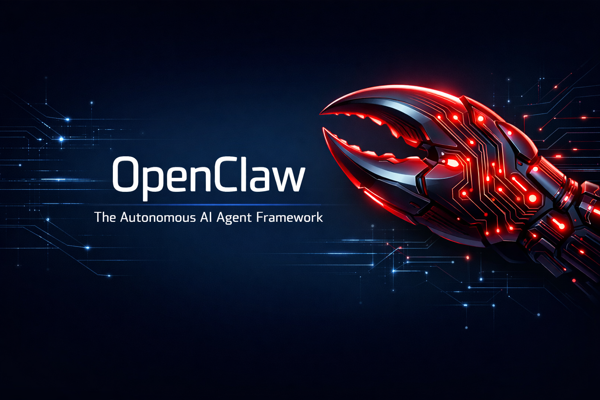
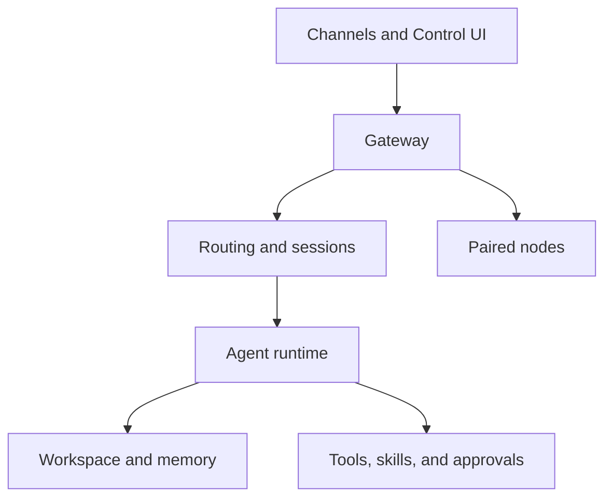

<p align="center">
  
</p>

<h1 align="center">OpenClaw Master Guide</h1>

<p align="center">
  A practical field manual for installing, understanding, securing, and operating OpenClaw.
</p>

<p align="center">
  <a href="https://github.com/openclaw/openclaw"></a>
  <a href="https://docs.openclaw.ai"></a>
  <a href="SECURITY.md"></a>
</p>

> [!IMPORTANT]
> This is an independent learning and operations guide. OpenClaw changes quickly; commands in the **Verified path** are checked against the official documentation, while pages marked **Blueprint** describe designs that require your own integrations.

## Start here

| Your goal | Read this |
| --- | --- |
| Install and send the first message | [Quickstart](docs/QUICKSTART.md) |
| Understand Gateway, agents, sessions, and nodes | [Architecture](docs/ARCHITECTURE.md) |
| Shape identity, behavior, memory, and heartbeats | [Workspace files](docs/WORKSPACE.md) |
| Choose cron, heartbeat, hooks, or task flows | [Automation](docs/AUTOMATION.md) |
| Harden a real deployment | [Security hardening](docs/SECURITY.md) |
| Operate an always-on instance | [Production operations](docs/PRODUCTION.md) |
| Route multiple isolated agents | [Multi-agent systems](docs/MULTI_AGENT.md) |
| Diagnose a broken installation | [Troubleshooting](docs/TROUBLESHOOTING.md) |
| Look up safe, verified commands | [Command reference](docs/COMMAND_REFERENCE.md) |
| Explore implementation ideas | [46 use-case blueprints](USE_CASES.md) |

## The 10-minute verified path

Requirements: a supported macOS, Linux, or Windows environment and a model-provider credential. Current OpenClaw documentation recommends Node 24; the installer handles Node automatically.

### macOS, Linux, or WSL2

```bash
curl -fsSL https://openclaw.ai/install.sh | bash
openclaw onboard --install-daemon
```

### Windows PowerShell

```powershell
iwr -useb https://openclaw.ai/install.ps1 | iex
openclaw onboard --install-daemon
```

### Verify

```bash
openclaw gateway status
openclaw dashboard
```

Before connecting a public or team channel, complete the [security hardening checklist](docs/SECURITY.md).

## Mental model


```mermaid
flowchart TD
    C["Channels and Control UI"] --> G["Gateway"]
    G --> R["Routing and sessions"]
    R --> A["Agent runtime"]
    A --> W["Workspace and memory"]
    A --> T["Tools, skills, and approvals"]
    G --> N["Paired nodes"]
```

- **Gateway** is the long-lived control plane for channels, routing, sessions, automation, and connected nodes.
- **Agent** is an isolated runtime with its own workspace, credentials, model registry, and session history.
- **Workspace** supplies persistent operating instructions such as `AGENTS.md`, `SOUL.md`, and `HEARTBEAT.md`.
- **Skills and tools** add capabilities. Tool policy, sandboxing, approvals, and allowlists enforce the real boundary.
- **Sessions** carry conversational state; memory files preserve selected knowledge beyond a single session.

## Repository map

```text
.
├── README.md                 # Start page and navigation
├── USE_CASES.md              # Index of blueprint implementations
├── docs/                     # Verified concepts and operating guides
├── templates/basic/          # Safe workspace starter files
├── use-cases/                # Industry implementation blueprints
├── scripts/check_docs.py     # Local and CI documentation validation
├── CONTRIBUTING.md           # Contribution workflow
└── SECURITY.md               # Security reporting policy
```

## What this guide guarantees

- Verified command blocks link back to official documentation.
- Conceptual skills and integrations are labeled as blueprints.
- Security advice treats external content as untrusted input.
- Destructive, financial, medical, legal, infrastructure, and public-facing actions require explicit human approval.
- Repository checks validate internal links, documentation structure, and attribution constraints.

## Upstream sources

- [Official OpenClaw documentation](https://docs.openclaw.ai)
- [Official OpenClaw repository](https://github.com/openclaw/openclaw)
- [Gateway security guide](https://docs.openclaw.ai/gateway/security)
- [CLI reference](https://docs.openclaw.ai/cli)
- [Release notes](https://docs.openclaw.ai/releases)

## Contributing

Corrections, tested recipes, safer defaults, and reproducible examples are welcome. Read [CONTRIBUTING.md](CONTRIBUTING.md) before opening a pull request.

---

Maintained by [thejenilsoni](https://github.com/thejenilsoni).
