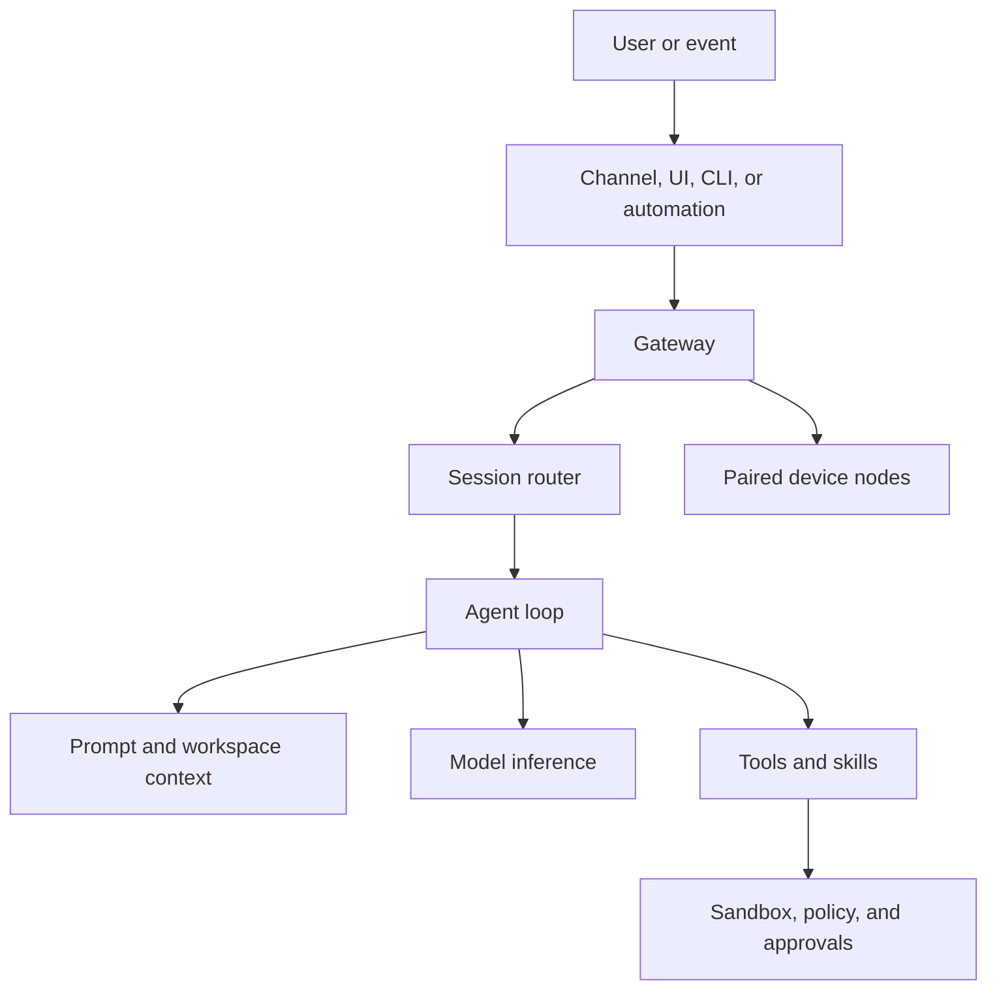
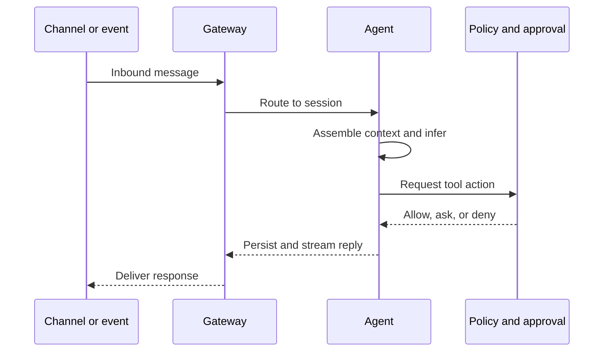

# Architecture

OpenClaw is centered on a single long-lived Gateway. The Gateway owns communication surfaces, session state, routing, automation, and the WebSocket control plane.

## System view

## Core components

### Gateway

- Maintains provider and channel connections.
- Exposes a typed WebSocket API to clients and nodes.
- Owns sessions, delivery, health, cron, heartbeat, and presence events.
- Serves the Control UI and canvas host on the Gateway port.

The default bind is loopback on port `18789`. One Gateway should own a given host's channel session.

### Agent runtime

Each configured agent has:

- a workspace;
- an agent state directory;
- provider/auth profiles;
- a model registry;
- a session store;
- its own tool and sandbox policy overrides.

The agent loop serializes intake, context assembly, inference, tool execution, streaming, persistence, and reply delivery for a session.

### Sessions

Inbound messages are mapped to sessions based on source and routing configuration. The Gateway owns session data; clients query it rather than maintaining a second source of truth.

Do not confuse a session with long-term memory. A session is the working interaction history. Curated workspace memory persists selected facts and operating knowledge.

### Nodes

Desktop, mobile, and headless nodes connect to the Gateway with an explicit node role and advertised capabilities. Pair nodes deliberately and grant only the capabilities required by the workflow.

### Workspace

The workspace is the agent's working directory and supplies bootstrap context. It holds behavior, identity, user preferences, tool conventions, heartbeat checks, and long-term memory. See [Workspace files](WORKSPACE.md).

## Message lifecycle

## Trust boundaries

Treat every boundary separately:

1. **Sender trust** — pairing, DM policy, room allowlists, mention gating.
2. **Content trust** — pages, attachments, emails, documents, and tool output may contain prompt injection.
3. **Capability trust** — tool allow/deny policy controls what the model may request.
4. **Execution trust** — sandboxing constrains where code runs.
5. **Decision trust** — approvals stop sensitive actions until a human confirms.
6. **Credential trust** — secrets must remain outside agent-readable workspace files and logs.

## Official references

- [Gateway architecture](https://docs.openclaw.ai/concepts/architecture)
- [Agent runtime](https://docs.openclaw.ai/concepts/agent)
- [Agent loop](https://docs.openclaw.ai/concepts/agent-loop)
- [Session management](https://docs.openclaw.ai/concepts/session)
