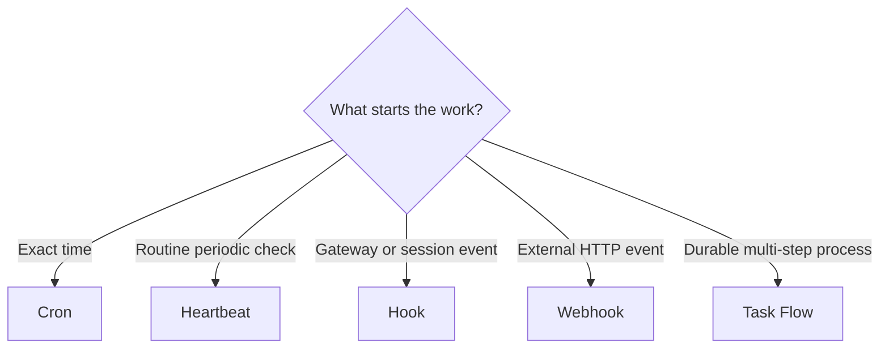

# Automation

Choose the simplest mechanism that matches the event and timing requirement.

| Mechanism | Best for | Timing | Creates a task record |
| --- | --- | --- | --- |
| Cron | exact schedules and one-shot reminders | precise | yes |
| Heartbeat | batched routine monitoring | periodic, approximate | no |
| Hooks | lifecycle and message events | event-driven | depends on action |
| Webhooks | external systems triggering work | event-driven | flow-dependent |
| Standing orders | durable context and authority | persistent | no by itself |
| Task Flow | multi-step durable coordination | workflow-driven | yes |

## Decision guide



## Safe automation pattern

Every automation should define:

1. **Trigger** — exact event, schedule, or condition.
2. **Inputs** — trusted sources and validation rules.
3. **Read scope** — data the agent may inspect.
4. **Action scope** — tools and destinations it may use.
5. **Approval gate** — actions a human must confirm.
6. **Idempotency** — how reruns avoid duplicate actions.
7. **Evidence** — logs, links, IDs, or artifacts that prove completion.
8. **Failure path** — retry policy, alert destination, and safe stop.

## Example: approval-first publishing

```text
Trigger: weekday research cron
Read: approved feeds and repository releases
Draft: summary plus source links
Validate: every claim has a source; no duplicate topic
Gate: human approves the final draft
Act: publish to one selected destination
Record: destination URL, timestamp, and source set
```

The research and drafting steps may run unattended. Publishing remains gated.

## Heartbeat hygiene

- Keep the checklist short enough for one turn.
- Batch related checks.
- Return a quiet success when nothing needs attention.
- Do not use heartbeat for exact deadlines.
- Do not hide destructive actions inside routine monitoring.

## Official references

- [Automation overview](https://docs.openclaw.ai/automation)
- [Scheduled tasks](https://docs.openclaw.ai/automation/cron-jobs)
- [Hooks](https://docs.openclaw.ai/automation/hooks)
- [Standing orders](https://docs.openclaw.ai/automation/standing-orders)
