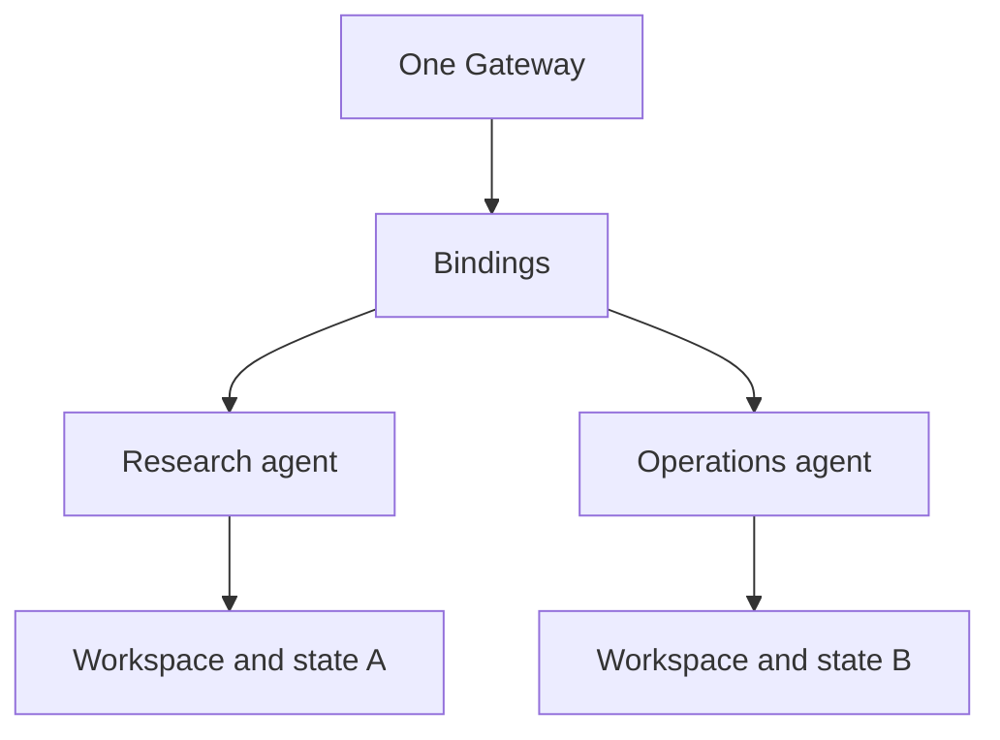

# Multi-agent systems

Use multiple agents when isolation or routing matters, not merely because a workflow has several steps.

## When separation is justified

- Different channel identities or audiences.
- Different credentials or data sensitivity.
- Different tool and sandbox policies.
- Separate workspaces and long-term memory.
- Independent operational ownership.

For a simple sequential workflow, one well-scoped agent plus tools or Task Flow is usually easier to operate.

## Isolation model

Each agent should have its own:

- workspace;
- state directory (`agentDir`);
- session store;
- authentication profile policy;
- tool allow/deny policy;
- sandbox configuration.

Never reuse an `agentDir` across agents. Shared state causes credential and session collisions.

## A safe two-agent pattern

### Research agent

- Reads public or approved sources.
- Produces cited drafts and structured findings.
- Cannot publish, send external messages, or mutate production systems.

### Operations agent

- Receives a reviewed artifact.
- Validates destination and action scope.
- Requires approval for external mutations.
- Records completion evidence.

This isolates adversarial source content from the agent holding action permissions.

## Routing checklist

- [ ] Every channel account maps to one intended agent.
- [ ] Group and DM rules are explicit.
- [ ] Each agent has a unique workspace and `agentDir`.
- [ ] Cross-session information is bounded and redacted.
- [ ] Credentials are scoped per agent or deliberately shared.
- [ ] Inter-agent content is treated as tool-routed data, not direct user authority.
- [ ] The action-holding agent independently validates requests.

## Official references

- [Multi-agent routing](https://docs.openclaw.ai/concepts/multi-agent)
- [Session tools](https://docs.openclaw.ai/concepts/session-tool)
- [Delegate architecture](https://docs.openclaw.ai/concepts/delegate-architecture)
