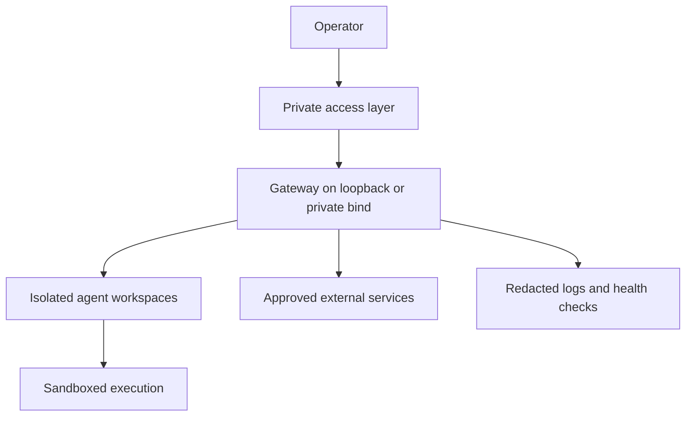

# Production operations

An always-on OpenClaw deployment is a security-sensitive service, not just a background chat process. Operate it with explicit network, update, backup, and recovery policies.

## Recommended topology



## Host baseline

- Use a dedicated user account with no unnecessary sudo access.
- Patch the operating system and runtime regularly.
- Bind locally by default; avoid direct public exposure.
- Restrict inbound firewall rules.
- Put remote administration behind a private network layer.
- Separate development and production workspaces and credentials.
- Set resource limits for containers and long-running tasks.

## Service verification

```bash
openclaw status --all
openclaw gateway status --deep
openclaw doctor --deep
openclaw channels status --probe
openclaw security audit --deep
```

## Update procedure

1. Back up configuration and curated workspace files.
2. Review release notes for configuration or protocol changes.
3. Preview the update where supported.
4. Apply the update.
5. Run doctor and restart the Gateway.
6. Probe every enabled channel.
7. Test one allowed and one denied action.
8. Verify cron, heartbeat, and task state.

Useful commands:

```bash
openclaw update status --json
openclaw update --dry-run
openclaw update
openclaw doctor --fix
openclaw gateway restart
```

## Backup scope

Back up:

- `openclaw.json` after removing or encrypting secrets;
- curated workspace Markdown and user-created artifacts;
- reviewed skill/plugin source or an immutable dependency manifest;
- automation definitions;
- a record of version and deployment configuration.

Handle separately:

- credentials and auth profiles;
- session databases and transcripts;
- logs and temporary files.

These may contain sensitive data and should not be copied into a normal source repository.

## Monitoring signals

- Gateway process and connectivity probe.
- Channel probe status.
- task failures and retry loops.
- repeated approval denials.
- tool-policy blocks and sandbox failures.
- authentication refresh failures.
- disk growth from logs, sessions, downloads, and browser profiles.
- unexpected plugin or skill changes.

## Recovery rule

Do not solve a version or protocol mismatch by weakening validation. Identify stale binaries and clients, restore a consistent version, run doctor, and reverify the service.

## Official references

- [Troubleshooting](https://docs.openclaw.ai/gateway/troubleshooting)
- [Updating](https://docs.openclaw.ai/install/updating)
- [Docker deployment](https://docs.openclaw.ai/install/docker)
- [Gateway security](https://docs.openclaw.ai/gateway/security)
